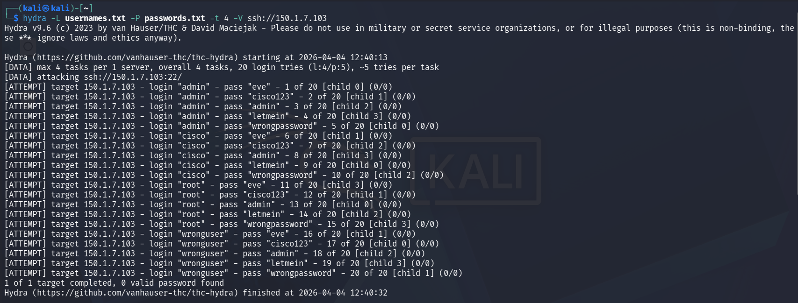
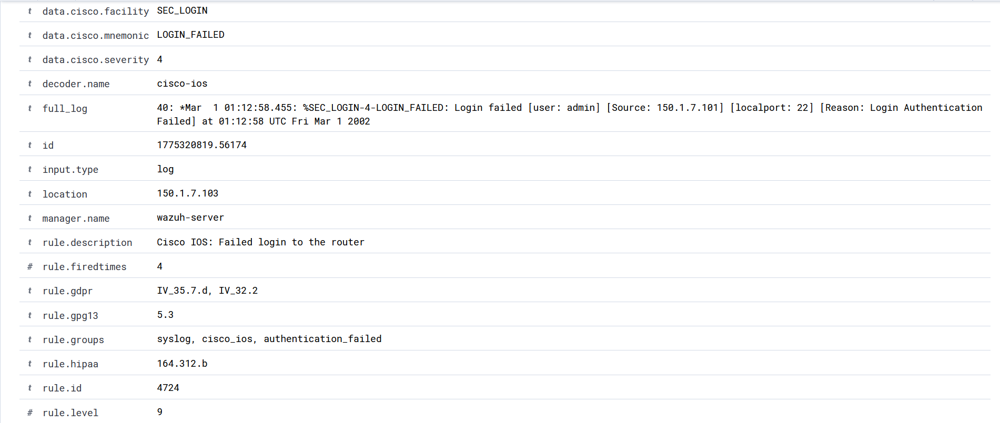

# 🛡️ Wazuh SIEM – SSH Brute-Force Detection on Cisco Router

A practical cybersecurity project demonstrating how **Wazuh SIEM** detects SSH brute-force attacks by collecting and analyzing syslog data from a Cisco 3725 router in real time.

---

## 🏗️ Environment

| Component                  | IP Address   | Role                               |
|----------------------------|--------------|------------------------------------|
| Kali Linux (attacker)      | 150.1.7.101  | Runs brute-force attack            |
| Cisco 3725 router (target) | 150.1.7.103  | Generates syslog logs              |
| Wazuh SIEM server          | 150.1.7.99   | Collects logs and generates alerts |
| Base machine               | 150.1.7.100  | Accesses Wazuh dashboard           |

---

## ⚙️ Configuration

### Cisco Router Syslog Configuration

```text
conf t
logging host 150.1.7.99
logging trap informational
login on-failure log
service timestamps log datetime msec
end
write memory
```

---

## ⚔️ Attack Simulation

The following command was used to simulate a brute-force attack:

```bash
hydra -L usernames.txt -P passwords.txt -t 4 -V ssh://150.1.7.103
```

This generated multiple failed SSH login attempts against the router.

---

## 🚨 Detection

Wazuh detected repeated authentication failures from the attacking machine.

**Example log:**

```
%SEC_LOGIN-4-LOGIN_FAILED: Login failed [user: admin] [Source: 150.1.7.101]
```

**Key Observation:**

Multiple failed login attempts from the same source IP within a short time indicate a brute-force attack pattern rather than isolated authentication errors.

---

## 🖼️ Screenshots

### 🔹 Attack Simulation (Hydra)



### 🔹 Wazuh Detection (Failed Login Alert)



---

## 🧠 Key Learnings

- How SIEM systems detect brute-force attacks using authentication logs
- Importance of monitoring repeated login failures
- Difference between single login failure and coordinated attack patterns
- How raw logs are transformed into actionable alerts

---

## 📌 Conclusion

This project demonstrates how Wazuh SIEM can effectively detect SSH brute-force attacks by analyzing router logs in real time.
It highlights the practical difference between simply collecting logs and actively detecting security threats.

---

## 🔮 Future Improvements

- Implement threshold-based alerting for repeated login failures
- Integrate active response to block attacker IP
- Extend monitoring to multiple network devices

---

## 🔗 Repository Structure

```
wazuh-router-threat-detection/
├── README.md
├── screenshots/
│   ├── attack.png
│   └── detection.png
├── configs/
│   └── router-syslog.txt
├── attack-simulation/
│   └── hydra-command.txt
```